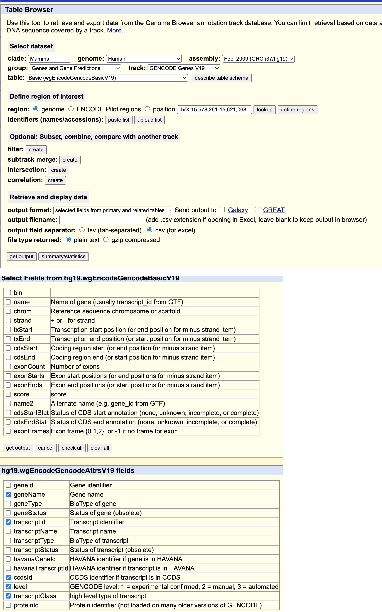
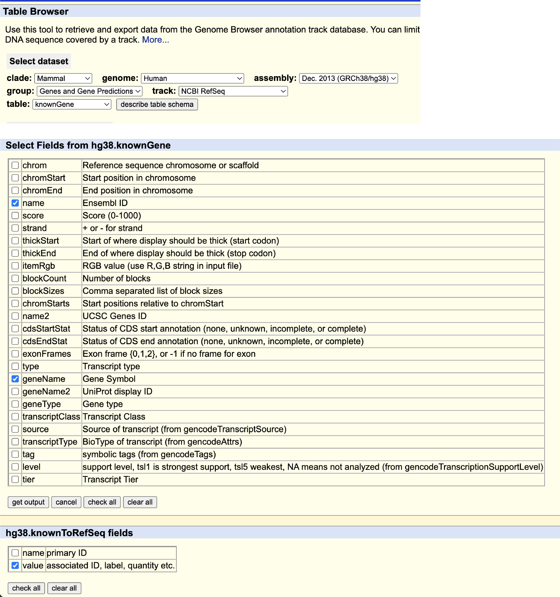
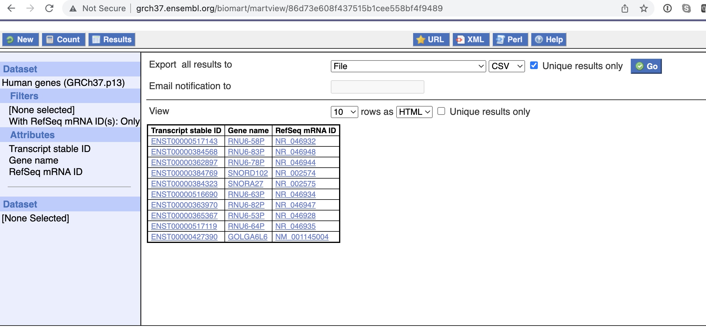

These are the steps involved in creating the gene.iobio.db

1. Install sqlite3. https://www.sqlite.org/download.html

2.  Create the schema for gene.iobio.db by running sql/schema.ddl in sqlite3.  
	```
	   sqlite3 gene.iobio.db < sql/schema.ddl
	```

3.  Download and uncompress the gff3 files for Gencode and RefSeq (Ensembl) for GRCh37 and GRCh38. These files go in the data/gencode and data/refseq directories respectively. 
	- [Gencode](https://www.gencodegenes.org/human/)
	    - [GRCh37](https://ftp.ebi.ac.uk/pub/databases/gencode/Gencode_human/release_41/GRCh37_mapping/gencode.v41lift37.annotation.gff3.gz)
		- [GRCh38](https://ftp.ebi.ac.uk/pub/databases/gencode/Gencode_human/release_41/gencode.v41.annotation.gff3.gz)
	- RefSeq
		- [GRCh37](https://ftp.ncbi.nlm.nih.gov/refseq/H_sapiens/annotation/GRCh37_latest/refseq_identifiers/GRCh37_latest_genomic.gff.gz)
		- [GRCh38](https://ftp.ncbi.nlm.nih.gov/refseq/H_sapiens/annotation/GRCh38_latest/refseq_identifiers/GRCh38_latest_genomic.gff.gz)
 

4.  Populate the gene.iobio.db from the gff3 files for each genome build
    
    -  Compile the java app.  
       - Install [Java JDK](https://www.oracle.com/java/technologies/downloads/)
       - Install [Apache Maven](https://maven.apache.org/)
       - From the command line, build the project
       ```
       mvn install
       ```
       - The class files will be created in the target/classes directory.
    -  Execute scripts/run_gff_importer.sh, which will import the gffs for each build an source. (This should take approximately 5 mins for each source/build to run)
      ```
      sh scripts/run_gff_importer.sh
      ```
    -  After the import, the script will output the gene counts by source and build. Verify that the gene counts look correct. Here is the output from the most
    recent run:
      ```
    		 gencode|GRCh37|63641
			 gencode|GRCh38|61815
			 refseq|GRCh37|31508
			 refseq|GRCh38|47757
		```


4. Update the gene.iobio.db transcripts table to specify the UTR features, which are not included in the GFF3, 
   but can be determined by reading the EXON and CDS features.
   -  This is a long running update statement, so it works better to update one reference (for a build) at a time.
   -  Run the bash shell script ./scripts/determineUTR.sh which will run the node.js script to perform the updates.
      ```sh scripts/determineUTR.sh
      ```

      When this script finished, both build GRCh37 and GRCh38 will be updated.  Update the .sh script if you
      want to run the updates on other builds.

    - Verify that the UTRs are now present in the features of the transcript
      ```sh scripts/verifyUTR.sh```
      You should see 2 lines for the UTR features of the canonical transcript for gene RAI1
      ```
      "feature_type":"UTR"
		"feature_type":"UTR"
      ```


5.  Update the canonical information on the gene.iobio.db transcripts.
    For build GRCh38, there is a is_canonical flag that can be used.  This flag can be found using
    the UCSC table browser.  
    How to get canonical and ccsd flags on transcripts:
	-  For GRCh38, you can get the canonical designation for a transcript using the UCSC 
	    table browser, use instructions outlined here:
	 	 	https://groups.google.com/a/soe.ucsc.edu/forum/#!topic/genome/_6asF5KciPc


```

In a new browser window navigate to the Table Browser: http://genome.ucsc.edu/cgi-bin/hgTables

1. Select hg38, and set "group:" "Genes and Gene Predictions" to track "GENCODE v22" (this should be the default selection).
2. Change table from "knownGene" to "knownCanonical". 
This step is a good opportunity to click the "describe table schema" button to see more about the table data you are requesting.


3. Change "output format" to "selected fields from primary and related tables".

This step allows you add information from other tables beyond the knownCanonical table.
4. Click "get output".
This screen is where we can add requests to get information from other tables, we are going to request information from the hg38 refGene table and the hg38 knownToEnsembl.
5. Scroll down to the "Linked Tables" section and click the box next to "hg38 refGene" and the box next to "hg38 knownToEnsembl".
6. Scroll to the very bottom and click the "allow selection from checked tables". 
Now we can select the fields we want from each of these three tables.
7. Under the "Select Fields from hg38.knownCanonical" click the box next to transcript.
This will be the transcript location driving all the related table output.
8. Under hg38.knownToEnsembl fields click "check all". 
9. Under hg38.refGene fields click "check all". 
10. Click "get output".

The results will be rows like the following: 

#hg38.knownCanonical.transcript    hg38.knownToEnsembl.name    hg38.knownToEnsembl.value    hg38.refGene.bin    hg38.refGene.name    hg38.refGene.chrom    hg38.refGene.strand    hg38.refGene.txStart    hg38.refGene.txEnd    hg38.refGene.cdsStart    hg38.refGene.cdsEnd    hg38.refGene.exonCount    hg38.refGene.exonStarts    hg38.refGene.exonEnds    hg38.refGene.score    hg38.refGene.name2    hg38.refGene.cdsStartStat    hg38.refGene.cdsEndStat    hg38.refGene.exonFrames

uc001ggs.5    uc001ggs.5    ENST00000367772.7    29    NM_181093    chr1    -    169853075    169893959    169853712    169888840    14    169853075,169854269,169855795,169859040,169862612,169864368,169866895,169868927,169870254,169873695,169875977,169878633,169888675,169893787,    169853772,169854964,169855957,169859212,169862797,169864508,169866973,169869039,169870357,169873752,169876091,169878819,169888890,169893959,    0    SCYL3    cmpl    cmpl    0,1,1,0,1,2,2,1,0,0,0,0,0,-1,
The first field (hg38.knownCanonical.transcript) is the id used from knownCanonical that is driving the selection of all the other data. The second two fields are the entire knownToEnsembl table that exists to provide the related ENST id (ENST00000367772.7), the remaining fields are all the fields from the refGene table that correspond to the entries in the knownCanonical table.

Please do make these selections independently. Here is a session to compare your steps against to help see the output: http://genome.ucsc.edu/cgi-bin/hgTables?hgS_doOtherUser=submit&hgS_otherUserName=Brian%20Lee&hgS_otherUserSessionName=hg38.refGene.canonical


In a new browser window navigate to the Table Browser: http://genome.ucsc.edu/cgi-bin/hgTables

1. Select hg38, and set "group:" "Genes and Gene Predictions" to track "GENCODE v22" (this should be the default selection).
2. Change table from "knownGene" to "knownCanonical". 
This step is a good opportunity to click the "describe table schema" button to see more about the table data you are requesting.


3. Change "output format" to "selected fields from primary and related tables".

This step allows you add information from other tables beyond the knownCanonical table.
4. Click "get output".
This screen is where we can add requests to get information from other tables, we are going to request information from the hg38 refGene table and the hg38 knownToEnsembl.
5. Scroll down to the "Linked Tables" section and click the box next to "hg38 refGene" and the box next to "hg38 knownToEnsembl".
6. Scroll to the very bottom and click the "allow selection from checked tables". 
Now we can select the fields we want from each of these three tables.
7. Under the "Select Fields from hg38.knownCanonical" click the box next to transcript.
This will be the transcript location driving all the related table output.
8. Under hg38.knownToEnsembl fields click "check all". 
9. Under hg38.refGene fields click "check all". 
10. Click "get output".

The results will be rows like the following: 

#hg38.knownCanonical.transcript    hg38.knownToEnsembl.name    hg38.knownToEnsembl.value    hg38.refGene.bin    hg38.refGene.name    hg38.refGene.chrom    hg38.refGene.strand    hg38.refGene.txStart    hg38.refGene.txEnd    hg38.refGene.cdsStart    hg38.refGene.cdsEnd    hg38.refGene.exonCount    hg38.refGene.exonStarts    hg38.refGene.exonEnds    hg38.refGene.score    hg38.refGene.name2    hg38.refGene.cdsStartStat    hg38.refGene.cdsEndStat    hg38.refGene.exonFrames

uc001ggs.5    uc001ggs.5    ENST00000367772.7    29    NM_181093    chr1    -    169853075    169893959    169853712    169888840    14    169853075,169854269,169855795,169859040,169862612,169864368,169866895,169868927,169870254,169873695,169875977,169878633,169888675,169893787,    169853772,169854964,169855957,169859212,169862797,169864508,169866973,169869039,169870357,169873752,169876091,169878819,169888890,169893959,    0    SCYL3    cmpl    cmpl    0,1,1,0,1,2,2,1,0,0,0,0,0,-1,
The first field (hg38.knownCanonical.transcript) is the id used from knownCanonical that is driving the selection of all the other data. The second two fields are the entire knownToEnsembl table that exists to provide the related ENST id (ENST00000367772.7), the remaining fields are all the fields from the refGene table that correspond to the entries in the knownCanonical table.

Please do make these selections independently. Here is a session to compare your steps against to help see the output: http://genome.ucsc.edu/cgi-bin/hgTables?hgS_doOtherUser=submit&hgS_otherUserName=Brian%20Lee&hgS_otherUserSessionName=hg38.refGene.canonical
```

- 	Remember to join to tables to get the gencode transcript id (align id)
	-  Use excel to convert tsv to csv
	-  For GRCh37, you can get the ccds_id from the UCSC table browser, using a similar technique described above. 
	<p align="center">
		  
	</p>
	 
	-  Use excel to convert tsv to csv
	-  Run sql script sql/update_transcripts_for_canonical.sql which will update both the is_canonical for GRCh38 transcripts and the ccds_id for GRCh37 transcripts. 
		- First, update the .sql script .import lines to reference the files that you downloaded in the ./data/canonical directory
		- Make sure you are in the root directory where the gene.iobio.db file resides
		- Run the sql script
		```sqlite3 gene.iobio.db 
		```

		 ```
		   > (copy and paste contents of sql/update_transcripts_for_canonical.sql here)
		   > .exit
		 ```

	- Verify the counts 
		```sh scripts/verify_canonical.sh```

	  Here is the output from the latest run, showing ~62,000 transcripts for build GRCh38 flagged as canonical and ~200 transcripts for build GRCh37 with a CCDS id.:
	  ```
	  	IS CANONICAL
		gencode|GRCh38||189384
		gencode|GRCh38|true|61815
		CCDS_ID
		gencode|GRCh37|207
		```


6.  Update the xref tables to map gencode transcripts to refseq transcripts
    -  For GRCh38, use UCSC table browser. 
		<p align="center">
		  
		</p>    

	 
    -  For GRCh37, use Ensembl Biomart.  
		<p align="center">
		  
		</p>    
    -  Use excel to convert tsv to csv
    -  Now run sql script insert_transcripts_xref.sql in gene.iobio.db
      ```cd ..
		   sqlite3 gene.iobio.db 
		 ```
		 ```
		   > (copy and paste contents of ./sql/insert_transcripts_xref.sql here)
		   > .exit
		 ```
 	- Verify the counts 
		```sh scripts/verify_transcripts_xref.sh```

	  Here is the output from the latest run:
	  ```
	   XREF GENCODE -> REFSEQ
		gencode|GRCh37|33407
		gencode|GRCh38|21233
		XREF REFSEQ -> GENCODE
		refseq|GRCh37|34944
		refseq|GRCh38|68295
	  ```

	  


 7.  Record MANE transcripts
    - Download the MANE gff from https://ftp.ncbi.nlm.nih.gov/refseq/MANE/MANE_human/
    - Extract the transcript lines from the 'gff', passing in the path to the MANE gff
      ```sh scripts/extract_mane_transcripts.sh data/mane/MANE.GRCh38.v1.0.ensembl_genomic.gff > data/mane/transcripts.csv``
    - Run sql script sql/update_mane_transcripts.sql which will update is_mane_select for GRCh38 transcripts. 
		```
		   sqlite3 gene.iobio.db 
		```
		 
		```
		   > (copy and paste contents of ./sql/update_mane_transcripts.sql here)
		   > .exit
		```

	  - Verify the counts 
		```sh scripts/verify_mane_select.sh```

	  Here is the output from the latest run:
	  ```
	  	IS MANE SELECT
		gencode|GRCh38||189384
		gencode|GRCh38|true|61815
		refseq|GRCh38||155012
		```

